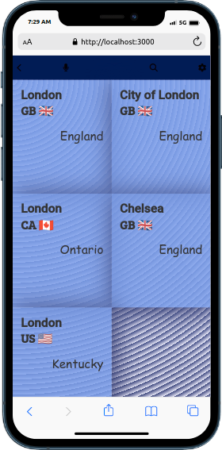
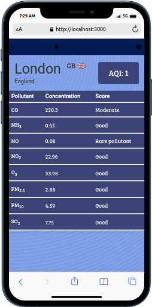

# Air Pollution Tracking App

> This is a simple single page application that tracks current air pollution data in any city in the world. It gives hourly average data on levels of concentration of various pollutes including Carbon Mono-Oxide, Ozone, PM25, PM10 among others. It is a good place to check the quality of the air in your local city or any city you would like to visit before you visit.

## Built With

- React
- Redux
- CSS

## Live Demo

 

- [Live Demo Link](https://airpollutiontracker.netlify.app/)
- [Loom Presentation Video Link](https://www.loom.com/share/6bb9836479b147799efb9e2f413828f4)

## Getting Started

You can open the link in the <live demo> section above or you can make a copy by cloning this repository. Click on the search icon in the navbar to search for any city and select the city to check the average concentration levels of pollutes in that city in the past hour.
To get a local copy up and running follow these simple steps:

### Prerequisites

- Code editor
- Install Git
- Command Line Interface
- Basic knowledge of HTML, CSS, Javascript, React, and Redux
- Web browser

### Setup

- Open your command line and change directory to the destination on your local computer where you want your copy to be stored (You can use the terminal in VS code).
- Run this command in your command line or terminal: **git clone https://github.com/amon-cofie/Air-Pollution-Tracking-App.git**
- Change directory to the repository. You can use this command in the command line: **cd Air-Pollution-Tracking-App**
- The content of the repository should appear in the your code editor at this point if you are using the inbuilt terminal.
- You can open the repository from git bash in VS code at this point with the following command: **code .**

### Install

- All dependencies for this repository are listed in the package.json file.
- Run the command **npm install** to intall them
- You should ensure that you have the latest version of Node.js installed

### Usage

- You can run the command **npm start** to open the app on your local server
- You can also use the link in the <live demo> section above to visit the deplyed website

### Run tests

- This repository has tests written with jest testing library
- Run the command **npm test** to run all tests
- The tests can be found in the **tests** directory

### Deployment

- This project is deployed with netlify

## Author

👤 **David Amon-Cofie**

- GitHub: [@amon-cofie](https://github.com/amon-cofie)
- Twitter: [@amon_cofie](https://twitter.com/amon_cofie)
- LinkedIn: [David Amon-Cofie](https://www.linkedin.com/in/damon-cofie/)

## 🤝 Contributing

Contributions, issues, and feature requests are welcome!

Feel free to check the [issues page](https://github.com/amon-cofie/Air-Pollution-Tracking-App/issues).

## Show your support

Give a ⭐️ if you like this project!

## Acknowledgments

- Hat tip to anyone whose code was used
- Inspiration: Original design idea by [Nelson Sakwa on Behance.](https://www.behance.net/sakwadesignstudio)
- etc

## 📝 License

This project is [MIT](https://github.com/amon-cofie/Air-Pollution-Tracking-App/blob/dev/LICENSE) licensed.
